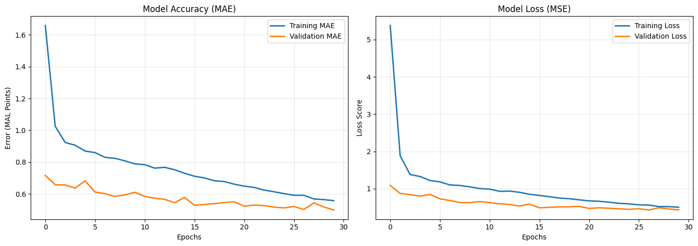
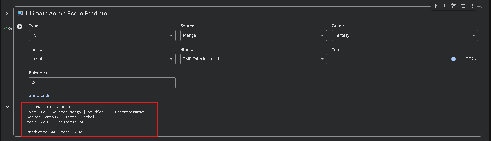

<h1 align="center">📺 Anime Success Predictor</h1>

  
  
  
  

<h2>📌 Project Overview</h2>

  This project utilizes a <b>Deep Neural Network</b> to predict user ratings on MyAnimeList based on metadata such as Studios, Genres, Themes, and Source material. By analyzing over 14,000 titles, the model identifies complex patterns that drive anime success.

<h2>📊 Results</h2>
<ul>
  <li><b>Final Test MAE:</b> 0.4826</li>
  <li><b>Model Accuracy:</b> On average, predictions are within ±0.48 points of the actual rating on a 1-10 scale.</li>
  

  

</ul>

<h2>🛠️ Technical Challenges & Solutions</h2>

<h3>1. Solving the 'NaN' Loss Crisis</h3>

  <b>Challenge:</b> During initial training, the loss function returned <code>NaN</code> (Not a Number), breaking the model's weights.  
  <b>Solution:</b> Identified that <i>StandardScaler</i> was propagating missing values across the feature matrix. I implemented a robust <b>Imputation Strategy</b> using median values for years and constant placeholders for categorical themes, ensuring a mathematically stable input for the neural network.

<h3>2. High-Dimensional Feature Space</h3>

  <b>Challenge:</b> Converting categorical text into numeric data created a sparse matrix of nearly 1,000 features, leading to potential "memory bloat" and overfitting.  
  <b>Solution:</b> Utilized <b>One-Hot Encoding</b> combined with <b>Dropout Regularization (20%)</b>. This forced the network to learn generalized patterns rather than memorizing specific niche studios or rare genre combinations.

<h2>🚀 Interactive Demo</h2>

  The project features a custom <b>Inference Function</b> that allows users to input hypothetical anime data (Studio, Genre, Episodes) to receive an instant predicted score.
  

  

  <i>Developed as a Deep Learning Portfolio Project - 2026</i>

